# Team Track

Team Track is a full-stack online application designed for streamlining employee management within an enterprise. It utilizes technologies such as React JS, Spring Boot, and MySQL. The application provides capabilities for both employees and administrators. Employees can manage their attendance, leaves, and team information, while administrators can control attendance, leaves, employee data, departments, and designations. Team Track ensures secure authentication using JWT and robust data processing with Spring Data JPA and Hibernate. It aims to enhance organizational productivity by offering a comprehensive and user-friendly interface for tracking employee-related activities.

## Getting Started

### Prerequisites

- **Node.js:** Ensure you have Node.js installed.
- **Java:** Ensure you have Java SE 17 installed.
- **MySQL:** Ensure you have MySQL installed and configured.

### Installation

1. **Clone the repository:**

   ```sh
   https://github.com/rautishz/team-track.git](https://github.com/RautishZ/Team_Track.git
   ```

2. **Backend Setup:**

   - Navigate to the backend directory:
     ```sh
     cd team-track/backend
     ```
   - Install dependencies and build the application:
     ```sh
     ./mvnw clean install
     ```
   - Run the application:
     ```sh
     ./mvnw spring-boot:run
     ```

3. **Frontend Setup:**
   - Navigate to the frontend directory:
     ```sh
     cd team-track/frontend
     ```
   - Install dependencies:
     ```sh
     npm install
     ```
   - Start the development server:
     ```sh
     npm start
     ```

## Table of Contents

- [Introduction](#introduction)
- [Technology Stack](#technology-stack)
- [Features](#features)
  - [Employee Features](#employee-features)
  - [Admin Features](#admin-features)
  - [UI/UX Features](#uiux-features)
- [API Endpoints](#api-endpoints)
- [Data Security and Privacy](#data-security-and-privacy)
- [Conclusion](#conclusion)

# CHAPTER 1: INTRODUCTION

Team Track is an intelligent employee management program that is purposely built to boost the company’s operation by simplifying the handling of many employee-related procedures. Built for today’s modern business, Team Track combines contemporary technologies like React JS for front-end development, Spring Boot for back-end apps, and MySQL for data administration.

The main objective of Team Track is to give a simplified interface that consolidates commonly used steps in the operations of staff management. The notion also means that it focuses on functions like attendance, leave, team, and comprehensive administrative tools to bring an increase in operational effectiveness and productivity in a company at all levels.

Team Track provides an application architecture based on the use of modularity with a UI that is fully responsive and is designed with React JS. On the backend side, Spring Boot helps to design and run highly productive apps for huge enterprises in a short period; MySQL is a suitable database for storing crucial organizational data.

This chapter provides the preliminary groundwork for studying the different features and structure of Team Track. The succeeding chapters deal with details of the technological environment, the particularities of features for the employees and administrators, API points of presence, and lastly, how the application contributes to the improvement of organizational administration.

# CHAPTER 2: TECHNOLOGY STACK

## 2.1 Frontend Technologies

- **HTML:** Web pages in Team Track frontend are created with the help of HTML (HyperText Markup Language) that gives the base for the construction of websites. It outlines what can be delivered in terms of content and the organization structure within the application that the users will interface with.
- **CSS (Cascading Style Sheets):** CSS is incorporated in Team Track to increase the appeal and aesthetics of the HTML elements. It helps create uniformity in the design of the pages and even the devices that one uses to access those pages.
- **Tailwind CSS:** Tailwind CSS is used as a utility-first CSS framework to facilitate the user interface design and the provision of utility classes, enhancing the speed of styling without writing large custom CSS.
- **Bootstrap:** Team Track also uses Bootstrap, a CSS framework aimed at making applications responsive. It supplies numerous packagable elements and useful tools for establishing stylish web-based SW interfaces.
- **JavaScript:** JavaScript is responsible for making the frontend of Team Track interactive. It makes it possible to implement features like dynamically updating content, form validation, among others, on the client side.
- **React JS:** Team Track incorporates React JS, a JavaScript library for designing User Interfaces. The architecture of React is component-based, making development easier and enabling code reusability and enhanced data binding.
- **Axios:** Axios, an HTTP client based on promises, helps establish the connection from the frontend to the backend of Team Track. It handles incoming and outgoing requests that are not in real-time to achieve faster data acquisition and modification.
- **Redux:** Redux is used for state management in the Team Track application, ideal for applications dealing with complicated state conditions in multiple components. It centralizes state-related logic and ensures predictable data changes.
- **Browser Local Storage:** Team Track proposes that tokens and other data specific to the user should be saved in the browser's local storage on the client side. This approach secures handling of authentication tokens and session data.

## 2.2 Backend Technologies

- **JavaSE 17:** Java is the main language for backend development of Team Track due to its stability, multi-platform nature, and extensive ecosystem support.
- **Spring Boot 3.3.1:** Spring Boot constructs and executes production-grade Spring-powered, standalone apps that can be easily changed. It facilitates development by delivering end-of-the-line solutions for the production of Spring framework-based applications.
- **Hibernate:** Hibernate, an ORM (Object-Relational Mapping) framework, handles the interactions between the application and the database using Java objects and tables, hiding the complexity of SQL and assisting in data archiving.
- **Spring Data JPA:** Spring Data JPA simplifies the implementation of data access layers, providing APIs and principles for relational databases, minimizing redundancy, and handling database-related activities.
- **Spring Security:** Spring Security is utilized in Team Track for authentication, authorization, and security concerns, providing comprehensive solutions for endpoint protection, user management, roles, and access control.
- **JWT (JSON Web Token):** JWT is used in Team Track for authenticating and sending claims as JSON objects. It enhances security as tokens are digitally signed and their content validated during user authentication.
- **Password Encryption/Decryption:** Users’ passwords are encrypted and decrypted to secure data and ensure compliance with privacy regulations.

## 2.3 Database

- **MySQL 8.0:** MySQL is Team Track’s recommended relational database management system due to its stability, speed, and scalability. It efficiently stores and sustains structured data, assisting the application in handling them.

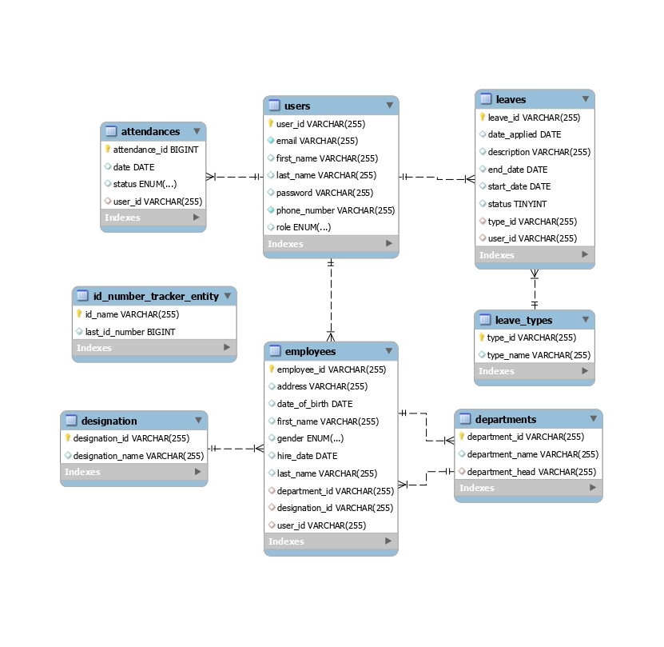

# CHAPTER 3: EMPLOYEE FEATURES

## 3.1 Employee Dashboard

As an employee, I may get a personalized dashboard within Team Track, providing a unified view of critical information and metrics relevant to my career and responsibilities. It includes:

- **Attendance Overview:** Displays my attendance records, showing days present, absent, and any leaves taken.
- **Leave Status:** Provides real-time updates on the status of my leave applications.
- **Team Information:** Offers insights into my team structure, including team members and their roles.
- **Notifications:** Alerts me about important announcements or tasks assigned to me.

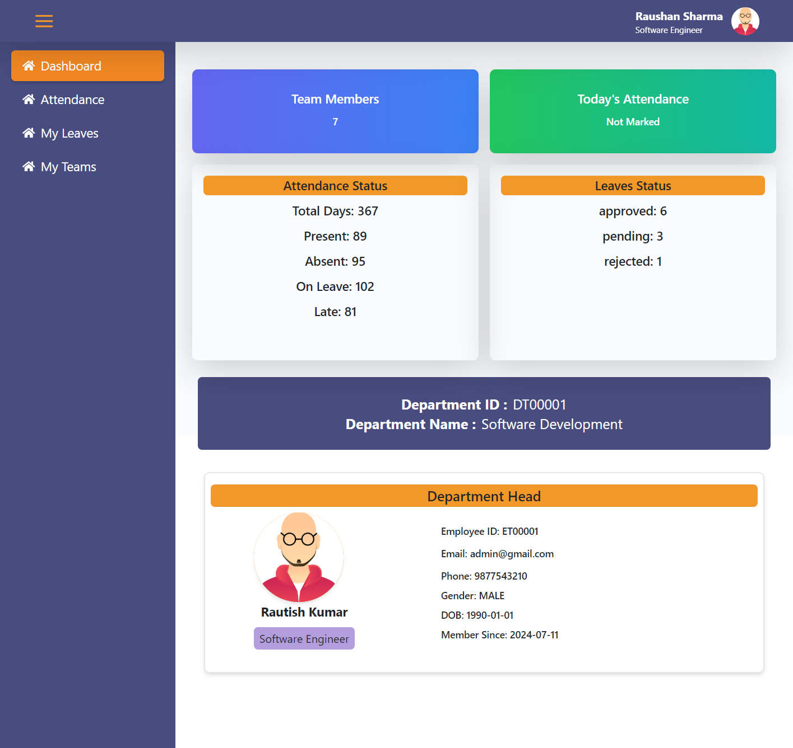

## 3.2 Attendance

In Team Track, I have the ability to monitor and manage my attendance effectively. This feature allows me to:

- **View Attendance Records:** Access detailed logs of my attendance history, including dates and statuses (present/absent/late/on leave).
- **View Attendance Trends:** Track my attendance trends over a specified period by year.

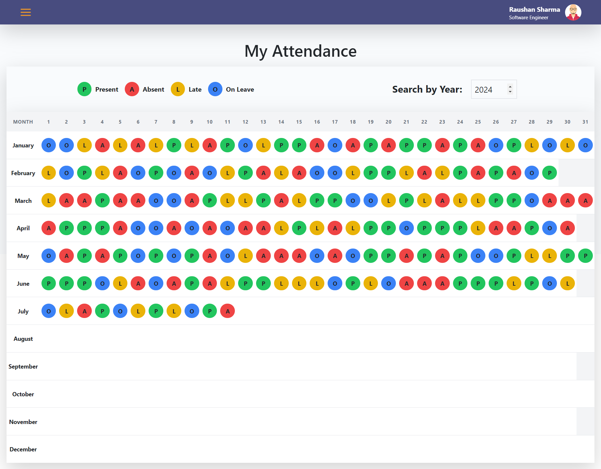

## 3.3 My Leaves

The "My Leaves" section in Team Track enables me to manage my leave applications seamlessly. Key functionalities include:

- **Apply for Leave:** Submit new leave requests with details such as leave type, start date, and end date.
- **View Leave History:** Access a record of all my past leave applications, including approved, pending, and rejected leaves.
- **Edit and Cancel Leaves:** Modify existing leave applications or cancel pending requests if necessary.

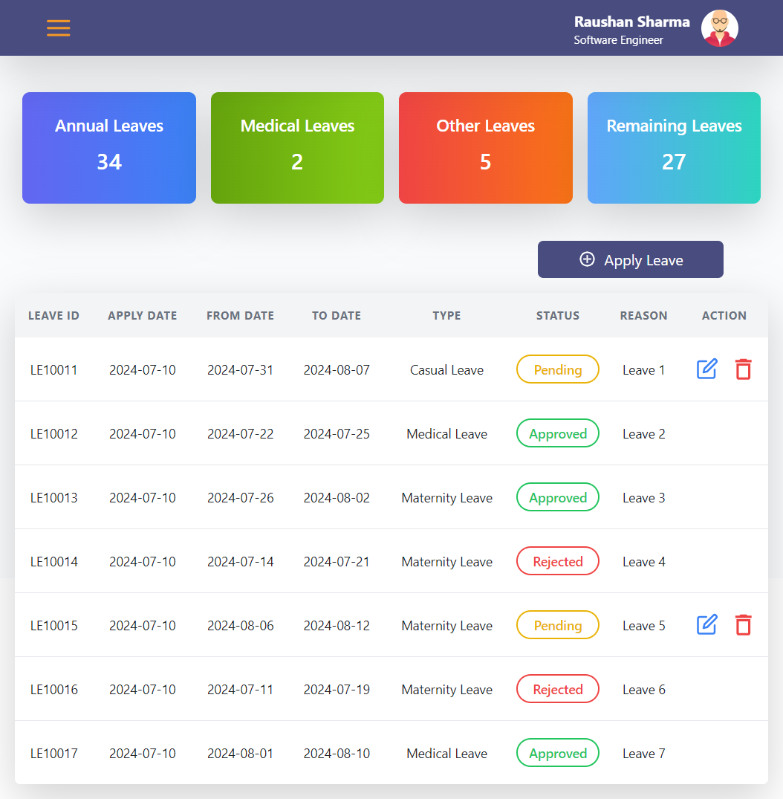

## 3.4 My Teams

In Team Track, I can stay informed about my team structure and collaborate effectively. This feature allows me to:

- **View Team Members:** Access a list of my team members, including their contact information and roles.
- **Team Collaboration:** Communicate and collaborate with team members on projects and tasks.
- **Team Performance:** Monitor team performance metrics and goals, if applicable.

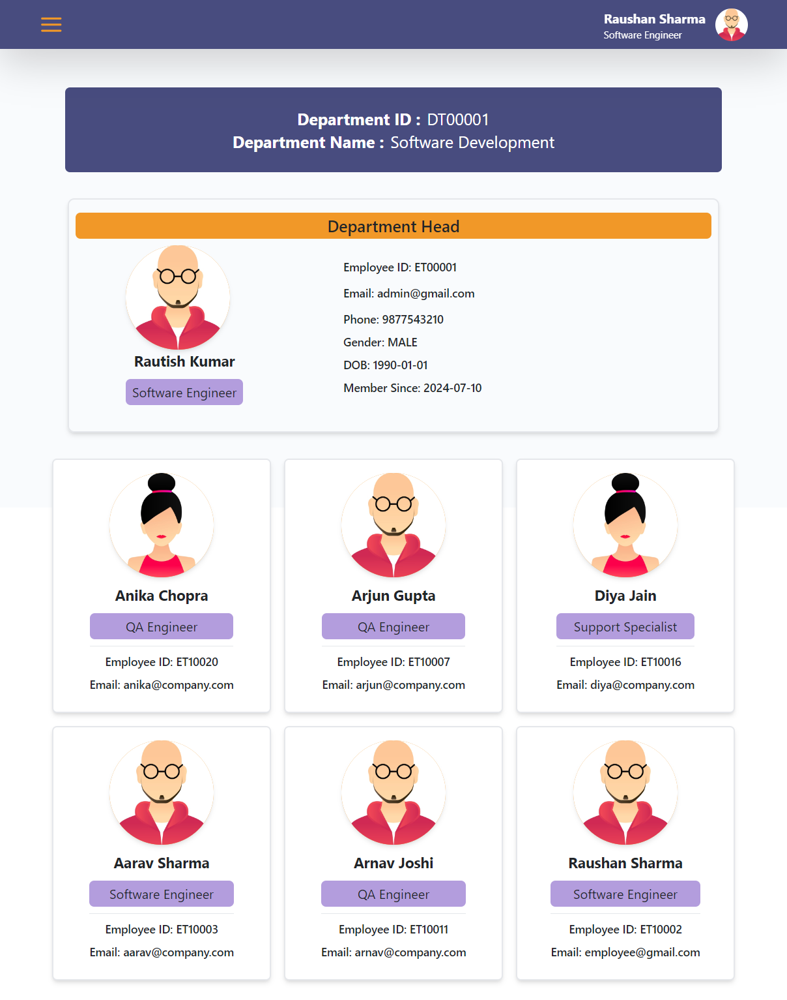

# CHAPTER 4: ADMIN FEATURES

## 4.1 Admin Dashboard

As an admin, I have access to a comprehensive dashboard that provides a holistic view of the organization’s key metrics and activities. This dashboard includes:

- **Organizational Overview:** A snapshot of critical metrics such as total employees, departments, and designations.
- **Attendance Statistics:** Insights into attendance applications, including the number of present, absent, late, on leave, and not marked.
- **Leave Statistics:** Insights into leave applications, including the number of approved, pending, and rejected requests.

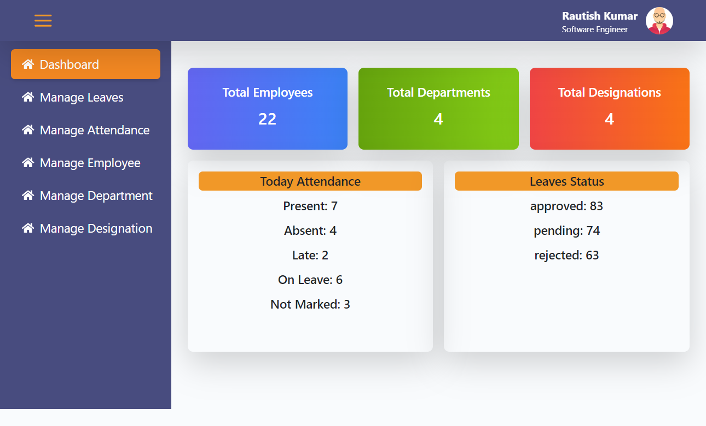

## 4.2 Manage Leaves

The leave management feature allows me to handle employee leave requests efficiently. It includes the following functionalities:

- **View Leave Applications:** Access a list of all leave applications, filtered by status (pending, approved, rejected).
- **Approve/Reject Leaves:** Evaluate leave requests and update their status with appropriate comments.

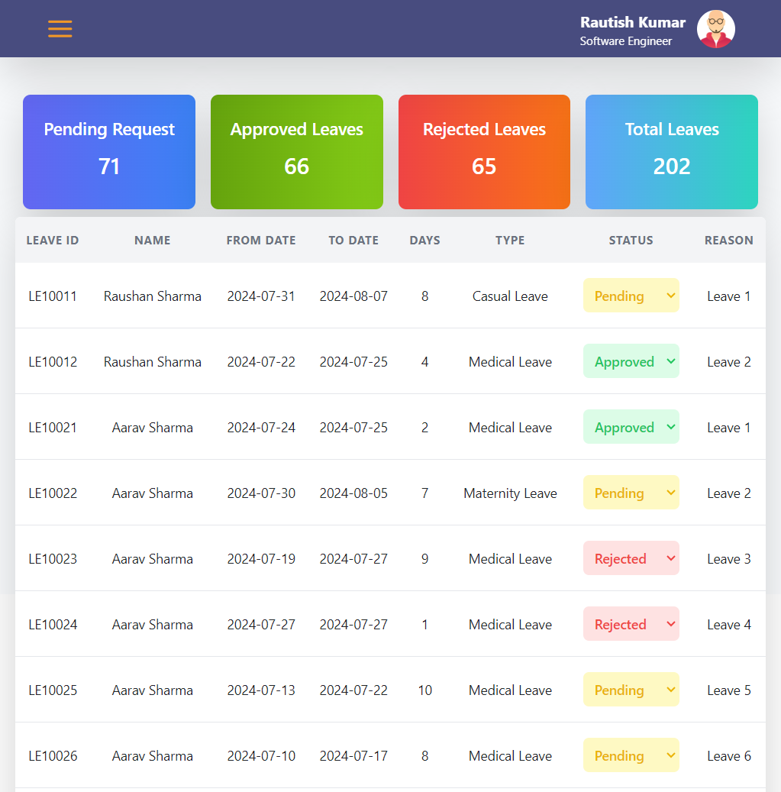

## 4.3 Manage Attendance

Team Track provides comprehensive tools for managing employee attendance. As an admin, I can:

- **Monitor Attendance Records:** View and update attendance records for all employees.
- **Attendance Correction:** Make corrections to attendance records to address discrepancies.

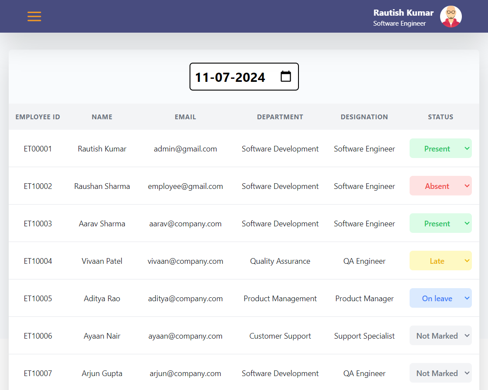

## 4.4 Manage Employee

Managing employee information is seamless with Team Track. Key features include:

- **Add New Employees:** Add new employee profiles with details such as personal information, job role, and department.
- **Update Employee Details:** Edit existing employee profiles to reflect changes in roles, contact information, or other personal details.
- **View Employee List:** Access a complete list of all employees with search and filter functionalities.

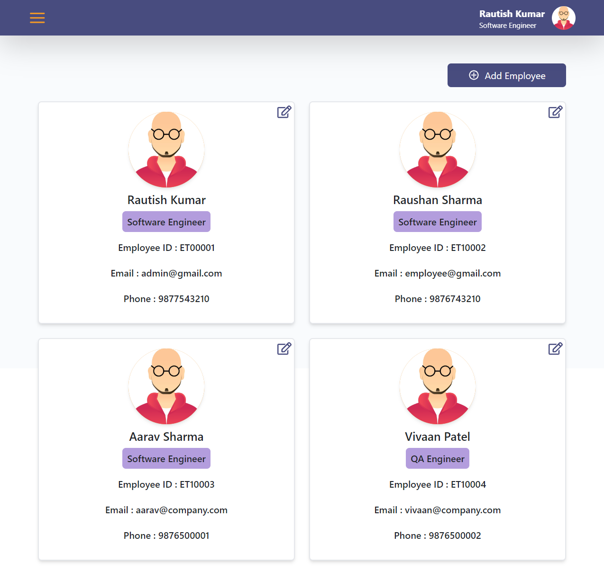

## 4.5 Manage Department

Efficient management of departments is crucial for organizational structure. Team Track provides tools to:

- **Add New Departments:** Create new departments and assign department heads.
- **Update Department Information:** Edit details of existing departments, such as department name and head.

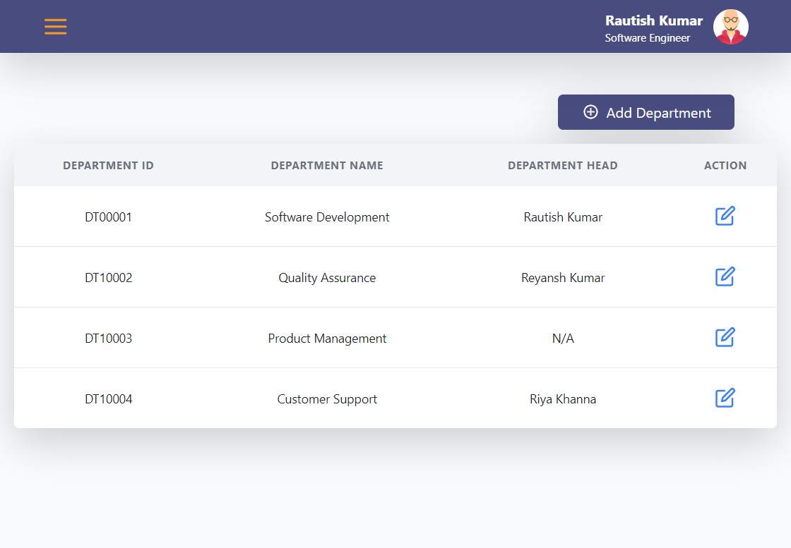

## 4.6 Manage Designation

Managing employee designations is straightforward with Team Track. we can:

- **Add New Designations:** Define new job titles and roles within the organization.
- **Update Designations:** Edit existing designations to reflect changes in responsibilities or job titles.

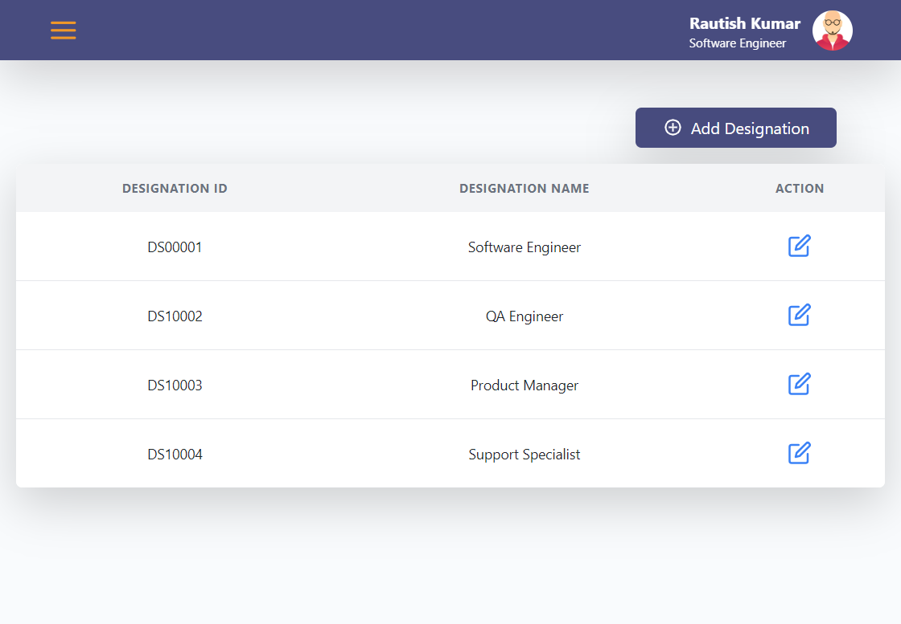

# CHAPTER 5: UI/UX FEATURES

## 5.1 Login Page

The login page in Team Track is designed to provide a seamless and secure authentication experience for users. Key features include:

- **User Authentication:** Utilizes Spring Security and JWT to ensure secure login credentials.
- **User-Friendly Design:** A clean and intuitive interface with input fields for email and password.
- **Error Handling:** Displays error messages for incorrect login attempts using Toastify notifications.

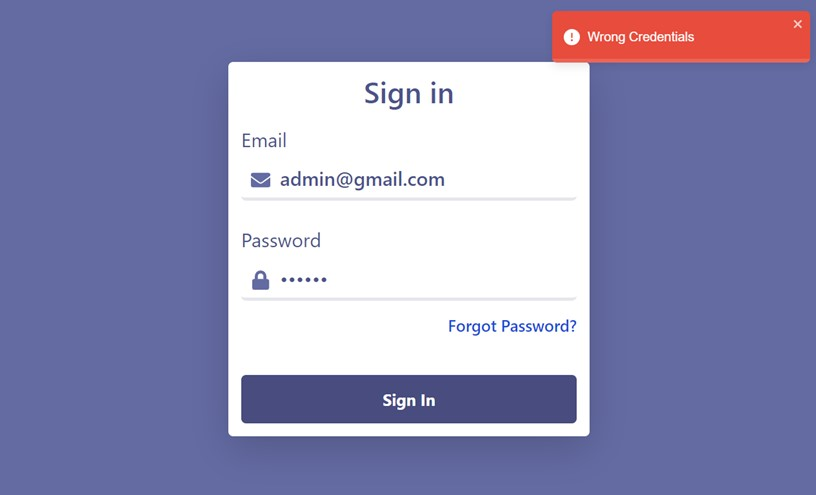

## 5.2 Sidebar

The sidebar is a crucial navigational element in Team Track, providing quick access to various features. Key elements include:

- **Collapsible Design:** The sidebar can be expanded or collapsed to save screen space.
- **Navigation Links:** Provides easy access to different sections such as Dashboard, Attendance, Leaves, Teams, and Admin features.
- **User Profile:** Displays the logged-in user’s profile picture and name.

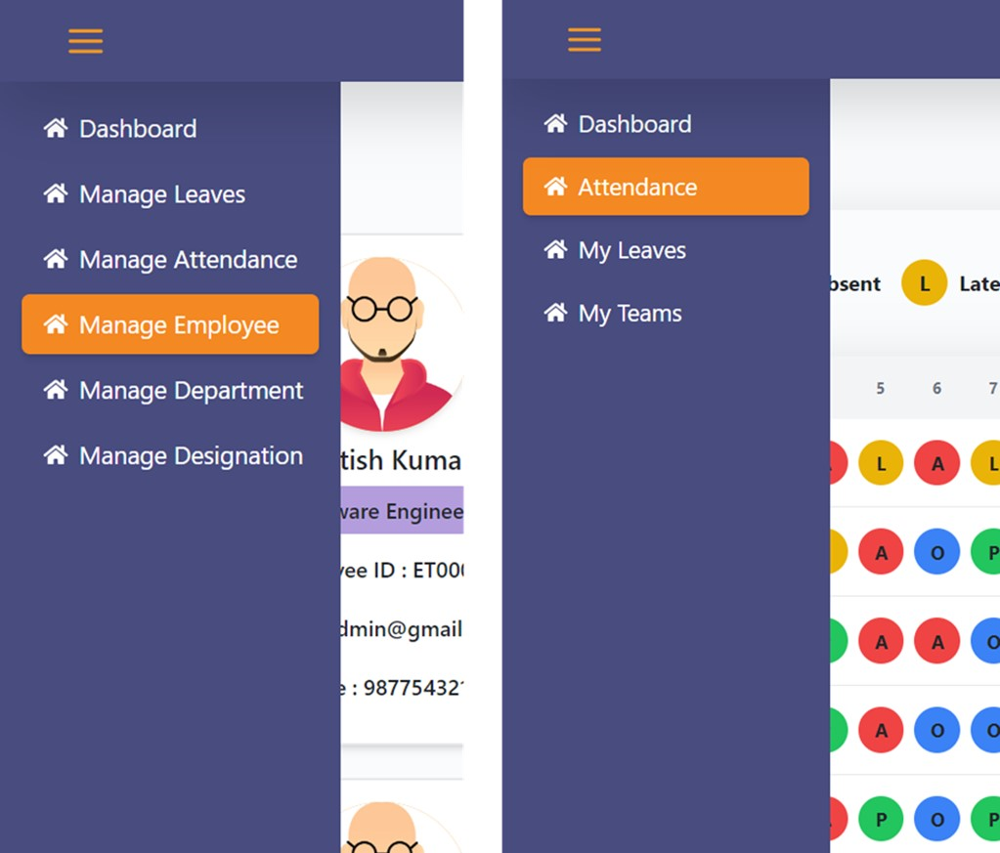

# CHAPTER 6: API ENDPOINTS

This chapter provides an overview of the API endpoints available in the Employee Management Application.

## 6.1 User Authentication

- **POST /api/auth/login:** Authenticates user credentials and generates a JWT token.
- **POST /api/auth/register:** Registers a new user with the provided information.
- **GET /api/auth/user:** Retrieves the authenticated user’s profile information.

## 6.2 Attendance Management

- **GET /api/attendance:** Retrieves attendance records for the authenticated user.
- **POST /api/attendance/mark:** Marks attendance for the authenticated user.
- **PUT /api/attendance/update:** Updates attendance records for the authenticated user.

## 6.3 Leave Management

- **GET /api/leaves:** Retrieves leave applications for the authenticated user.
- **POST /api/leaves/apply:** Submits a new leave application.
- **PUT /api/leaves/update:** Updates an existing leave application.
- **DELETE /api/leaves/cancel:** Cancels a pending leave application.

## 6.4 Employee Management

- **GET /api/employees:** Retrieves a list of all employees.
- **POST /api/employees/add:** Adds a new employee.
- **PUT /api/employees/update:** Updates an existing employee’s information.
- **DELETE /api/employees/delete:** Deletes an employee.

## 6.5 Department Management

- **GET /api/departments:** Retrieves a list of all departments.
- **POST /api/departments/add:** Adds a new department.
- **PUT /api/departments/update:** Updates an existing department’s information.
- **DELETE /api/departments/delete:** Deletes a department.

## 6.6 Designation Management

- **GET /api/designations:** Retrieves a list of all designations.
- **POST /api/designations/add:** Adds a new designation.
- **PUT /api/designations/update:** Updates an existing designation’s information.
- **DELETE /api/designations/delete:** Deletes a designation.

# CHAPTER 7: DATA SECURITY AND PRIVACY

## 7.1 User Data Protection

Team Track takes data security and privacy seriously. Key measures include:

- **Data Encryption:** Encrypts sensitive data such as passwords and personal information.
- **Secure Communication:** Uses HTTPS to ensure secure communication between the client and server.
- **Access Control:** Implements role-based access control to restrict access to sensitive information.

## 7.2 Privacy Policy

Team Track adheres to a comprehensive privacy policy to protect user data. Key elements include:

- **Data Collection:** Specifies the types of data collected and the purpose of collection.
- **Data Usage:** Details how user data is used within the application.
- **Data Sharing:** Explains the circumstances under which user data may be shared with third parties.
- **User Rights:** Outlines the rights of users regarding their data, including access, correction, and deletion.

# CHAPTER 8: CONCLUSION

Team Track is a robust and efficient employee management application that leverages modern technologies to streamline organizational processes. By providing comprehensive features for both employees and administrators, Team Track aims to enhance productivity and improve overall organizational efficiency. With a strong focus on data security and privacy, Team Track ensures that user information is protected while delivering a seamless and user-friendly experience.

This document provides a detailed overview of Team Track’s features, technology stack, UI/UX design, API endpoints, and data security measures. It serves as a comprehensive guide for understanding the capabilities and benefits of the application, making it an invaluable resource for users and administrators alike.
